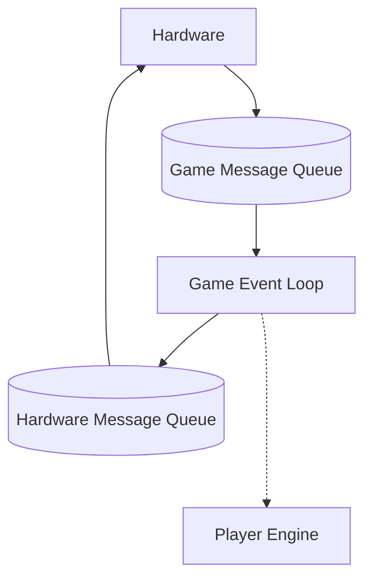
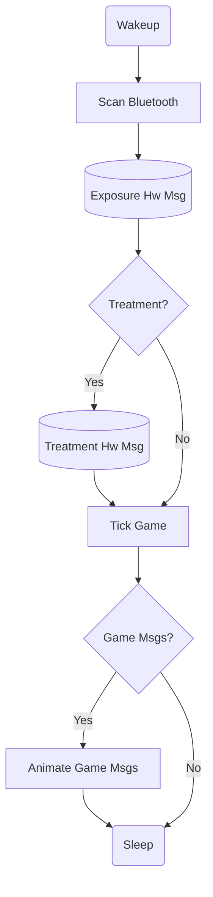
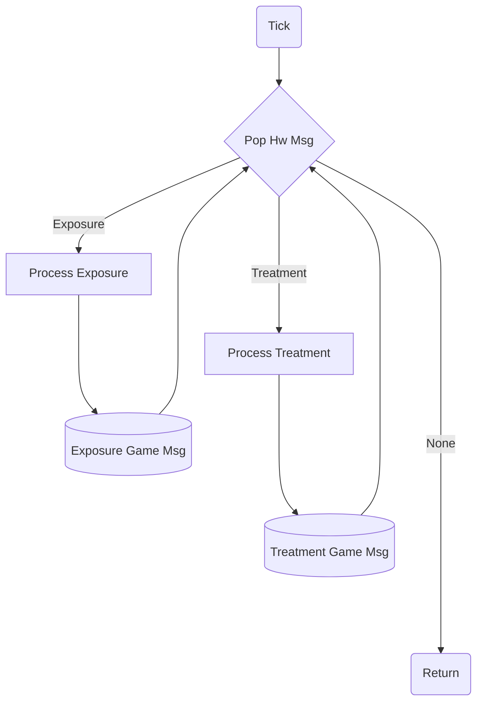

# superspreader


# Quickstart
## Build
Build a new development image
```shell
export UID=$(id -u) export GID=$(id -g); docker compose -f compose.dev.yml build
```
Start an interactive development container
```shell
docker compose -f compose.dev.yml run development
```
Build and upload the health monitor:
```shell
username@superspreader-dev:~/ws arduino-cli compile --fqbn esp32:esp32:esp32 src/superspreader/arduino/health_monitor
username@superspreader-dev:~/ws arduino-cli upload -p /dev/ttyUSB0 --fqbn esp32:esp32:esp32 src/superspreader/arduino/health_monitor
username@superspreader-dev:~/ws arduino-cli monitor -p /dev/ttyUSB0 -c baudrate=115200
```

On the host, be sure to run these commands so the container
has permissions to upload to the hardware.
```shell
sudo chmod 666 /dev/ttyUSB0
sudo chown $USER /dev/ttyUSB0
sudo adduser $USER dialout
```
# System Design

## Modules
Communication between the Hardware and Game Event Loop modules is done via message queue.
Hardware events are placed in the queue by the Hardware module then the Game is ticked.
The Game then processes the events, using the Player Engine to update the state of the game.
The Player Engine also executes context dependent closures passed to it while processing events, such as playing animations or setting global state.


### Persistent player state
The persistent game state is stored in special hardware memory represented by a struct from the Player Engine.
When the Hardware ticks the Game it sends the current player state.
Then the Game calls functions from the Player Engine to transform the state based on the events it received from hardware.
Once all messages are processed the persistent state is passed back to the hardware and the new state is stored in the special memory before sleep.

### Hardware Module
The hardware subsystem performs these steps on each wake-up:


### Game Module
The Game event loop processes the messages placed in the queue from the hardware on each tick.


### Player Engine
The player engine provides functions that transform the state based on events and the current state.
